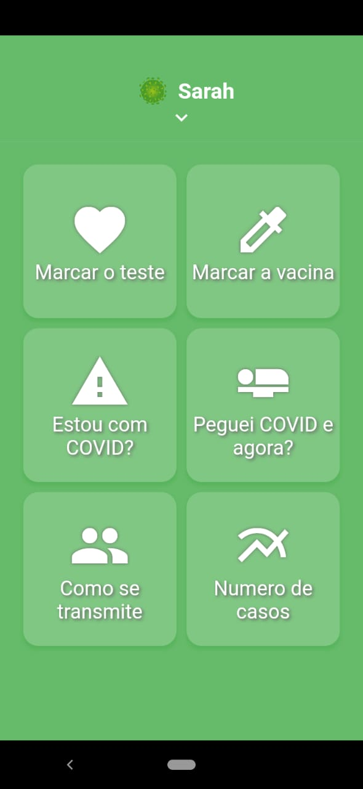

# Aplicativo XoCovid

Esse projeto faz parte do projeto Call for Code Hackathon.
Um Hackathon que tem como proposito criar soluções com tecnologia para ajudar no combate contra o COVID-19.

## Getting Started

{ width: 200px; }

### Tecnologias

* App: Flutter
* API: IBM Cloud - [Acesse o codigo aqui](https://github.com/danilofmesquita/call-for-code)
* IBM Watson Assistant