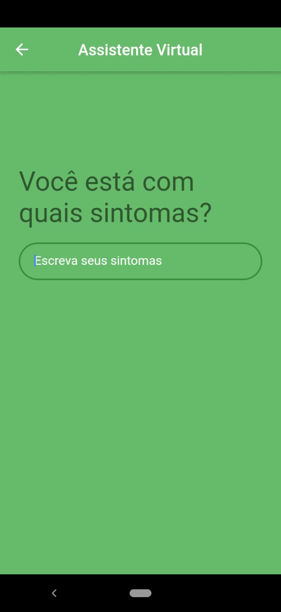
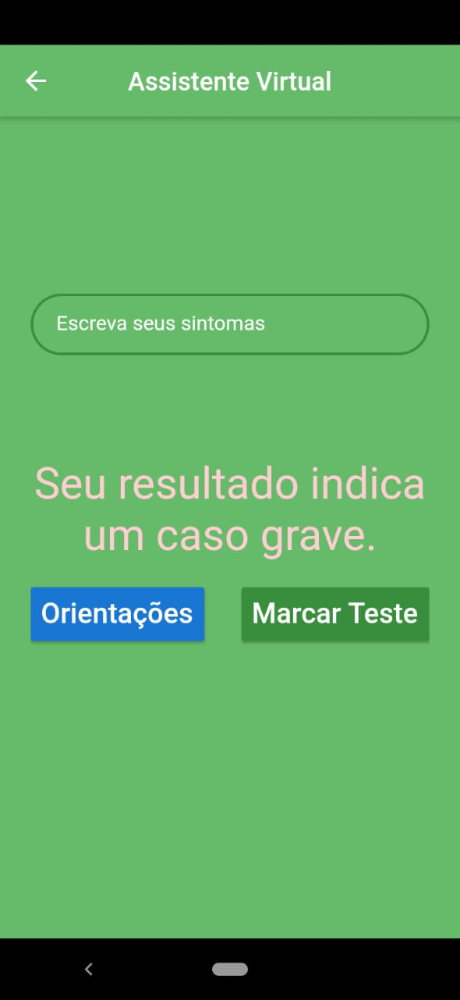
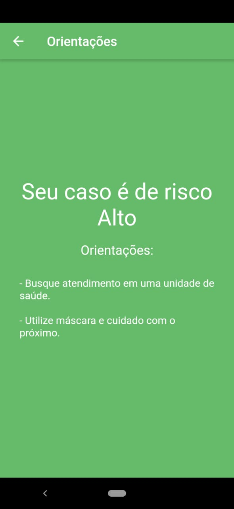
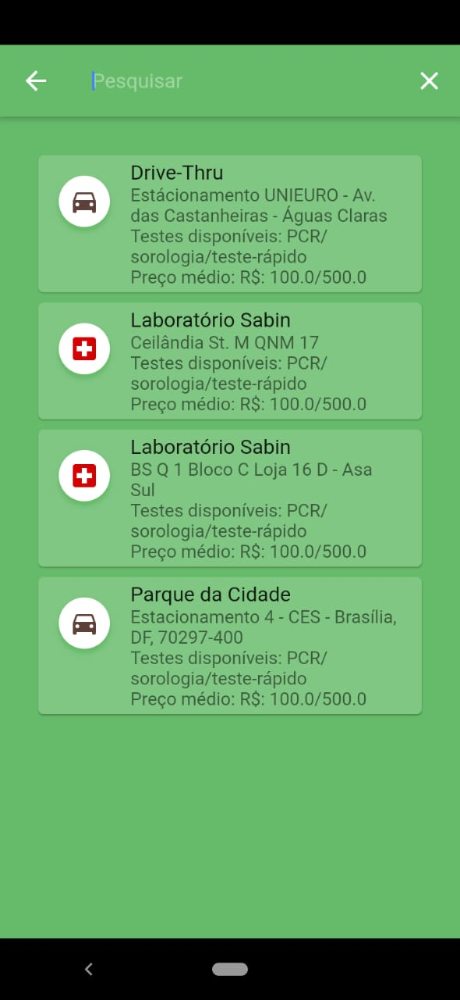
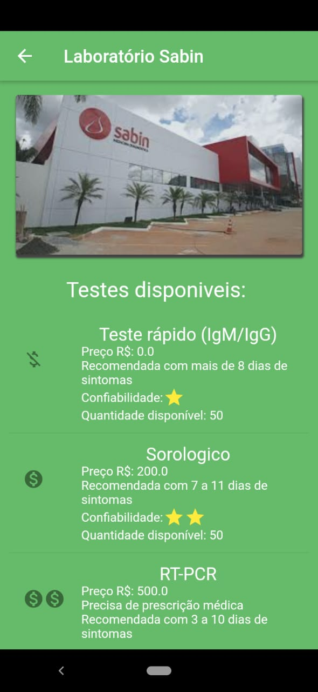
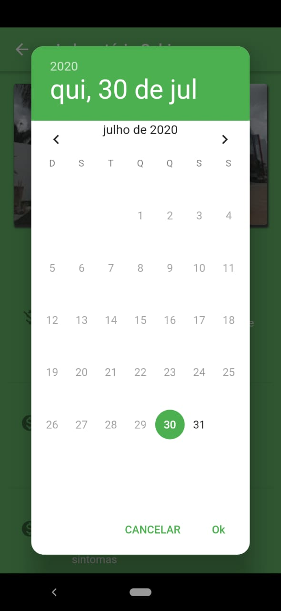
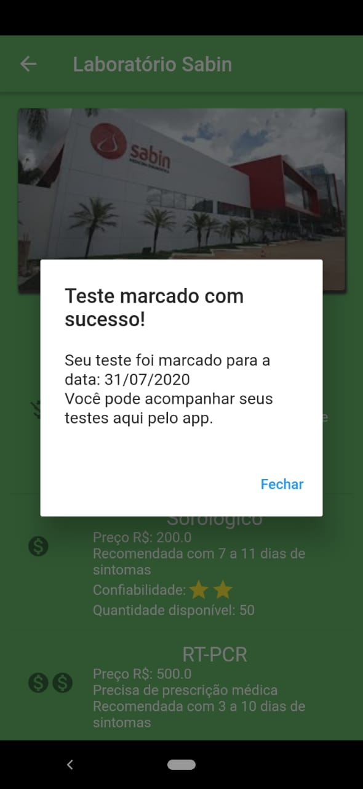

# Aplicativo Mediv

Esse projeto faz parte do projeto Call for Code Hackathon.
Um Hackathon que tem como proposito criar soluções com tecnologia para ajudar no combate contra o COVID-19.

## Aplicativo

### Sobre

Esse aplicativo tem alguns propositos:

* Fornecer informações mais claras para o usuário a respeito dos sintomas e dos testes.
* Fornecer informações de como proceder em caso de possível contaminação.

* Além disso, o app também vai possibilitar que o usuário encontre o lugar mais próximo para realizar o teste,
 e já realize a marcação do teste, por meio de uma agendamento.
* Por meio de um QR Code conseguiremos validar que o usuário marcou o teste, com isso vamos oferecer
 maior segurança tanto para o usuário quanto para a instuição que fornece os testes.
* Graças ao Watson da IBM poderemos fazer uma triagem simples e precisa para fornecer as melhores orientações ao usuário.
* E por fim, também temos como proposito atuar de frente quando surgir a vacina, para conseguir fornecer
 um meio de agendamento nos lugares mais próximos a fim de evitar aglomerações.

## Tecnologias usadas

* App: Flutter
* API: IBM Cloud - [Acesse o codigo aqui](https://github.com/danilofmesquita/call-for-code)
* IBM Watson Assistant